# 1.进制

**进制的定义**：N进制，由N个符号组成，逢N进1。

十进制是由十个符号组成，就一定是0、1、2、3、4、5、6、7、8、9么？其实并不是，我们既然说了是由符号组成，那么十进制也可以是由Q、8、E、 9 、a、 d f、 8、 k、 p、组成，由什么符号，取决于定义的那个人，我定义的十进制前30个表格是这样的：


| Q    | 8    | E    | 9    | a    | d    | f    | 8    | k    | p    |
| ---- | ---- | ---- | ---- | ---- | ---- | ---- | ---- | ---- | ---- |
| 8Q   | 88   | 8E   | 89   | 8a   | 8d   | 8f   | 88   | 8k   | 8p   |
| EQ   | E8   | EE   | E9   | Ea   | Ed   | Ef   | E8   | EK   | Ep   |


## 1.1 进制运算

基本了解进制后，我们需要了解进制间是如何运算的，八进制的10+4=？10-4=？10*4=？10/4=？首先，我们需要知道八进制的八个符号分别是什么，分别是：0、1、2、3、4、5、6、7。

那么如何计算呢？**1. 写出八进制的前50 2. 借助算术表**

八进制的前64表：


| 0    | 1    | 2    | 3    | 4    | 5    | 6    | 7    |
| ---- | ---- | ---- | ---- | ---- | ---- | ---- | ---- |
| 10   | 11   | 12   | 13   | 14   | 15   | 16   | 17   |
| 20   | 21   | 22   | 23   | 24   | 25   | 26   | 27   |
| 30   | 31   | 32   | 33   | 34   | 35   | 36   | 37   |
| 40   | 41   | 42   | 43   | 44   | 45   | 46   | 47   |
| 50   | 51   | 52   | 53   | 54   | 55   | 56   | 57   |
| 60   | 61   | 62   | 63   | 64   | 65   | 66   | 67   |
| 70   | 71   | 72   | 73   | 74   | 75   | 76   | 77   |


八进制的加法算术表：

| 1+1=2  |        |        |        |        |        |        |
| :----: | ------ | ------ | ------ | ------ | ------ | ------ |
| 1+2=3  | 2+2=4  |        |        |        |        |        |
| 1+3=4  | 2+3=5  | 3+3=6  |        |        |        |        |
| 1+4=5  | 2+4=6  | 3+4=7  | 4+4=10 |        |        |        |
| 1+5=6  | 2+5=7  | 3+5=10 | 4+5=11 | 5+5=12 |        |        |
| 1+6=7  | 2+6=10 | 3+6=11 | 4+6=12 | 5+6=13 | 6+6=14 |        |
| 1+7=10 | 2+7=11 | 3+7=12 | 4+7=13 | 5+7=14 | 6+7=15 | 7+7=16 |


## 1.2 二进制简写形式

在之前的课程概要中，我们说了计算机只能读懂机器语言（二进制），相信很多人就开始疑惑了，为什么计算机只能读懂二进制？原因是因为计算机是需要电的，而电路设计只有两种状态：1（真·通电）0（假·未通电），所以计算机中存储的任何文件、接收的任何指令都是由0和1组成的。

在这里，我们可以借助`UltraEdit`软件打开一个EXE文件：

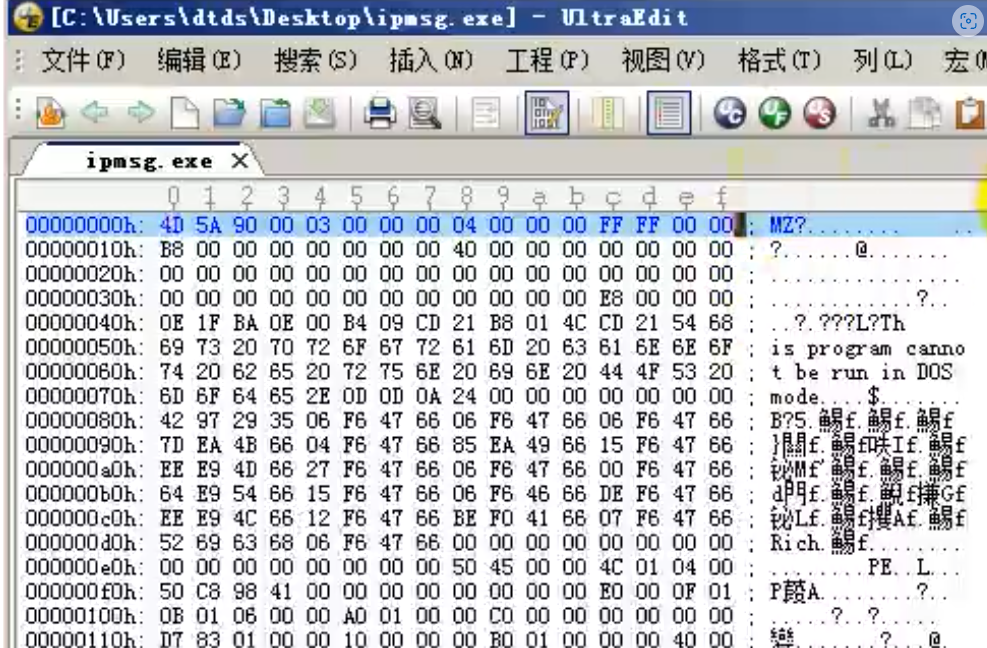


打开一看，为什么这里没有显示二进制0和1呢？是因为二进制使用、阅读都比较麻烦，所以如上图所示，展示出来的是十六进制，这里我们也可以称之为**二进制的简写方式**。

**在计算机中二进制和十六进制的对应关系如下：**

| 二进制   | 0000 | 0001 | 0010 | 0011 | 0100 | 0101 | 0110 | 0111 | 1000 | 1001 | 1010 | 1011 | 1100 | 1101 | 1110 | 1111 |
| -------- | ---- | ---- | ---- | ---- | ---- | ---- | ---- | ---- | ---- | ---- | ---- | ---- | ---- | ---- | ---- | ---- |
| 十六进制 | 0    | 1    | 2    | 3    | 4    | 5    | 6    | 7    | 8    | 9    | A    | B    | C    | D    | E    | F    |

这个对应关系表需要熟练掌握，做到看见二进制可以直接转为十六进制，反之亦然。


**python 代码  二进制转16进制练习：**

```python
import random

def bin_to_hex(bin_str):
    """将二进制字符串转换为16进制字符串"""
    hex_str = hex(int(bin_str, 2))[2:]  # 将二进制字符串转换为整数，再将整数转换为16进制字符串
    return hex_str.upper()  # 将16进制字符串转换为大写字母形式


correct_count = 0  # 记录正确次数

for i in range(100):
    # 随机生成4位二进制数
    bin_num = bin(random.randint(0, 15))[2:].zfill(4)  # 随机生成0~15之间的整数并将其转换为4位二进制数

    # 将二进制数转换为16进制数并输出
    hex_num = bin_to_hex(bin_num)
    print("请将二进制数", bin_num, "转换为16进制数：")

    # 循环等待用户输入16进制数，直到用户输入正确为止
    while True:
        user_input = input("> ")
        if user_input.upper() == hex_num:
            correct_count += 1
            print("正确")
            break
        else:
            print("错误，请再次输入：")

print("本次测试结束，共测试了", i + 1, "次，您的正确率为", correct_count / (i + 1) * 100, "%。")  # 输出测试结果

```


# 2. 数据宽度

我们熟知的数字，也就是数学上的数字，理论来说只要你能写、纸张足够多，那么你是可以写任意大小数字的；但在计算机中，因为受到硬件的制约，数据是有长度限制的，我们一般称之为**「数据宽度」**，**超出最多宽度的数据会被丢弃掉**。

数据宽度也有自己的单位：

| 名称               | 大小                                                         |
| ------------------ | ------------------------------------------------------------ |
| 位（BIT）          | █（1位）                                                     |
| 字节（Byte）       | █\|█\|█\|█\|█\|█\|█\|█（8位）                                |
| 字（Word）         | █\|█\|█\|█\|█\|█\|█\|█\|█\|█\|█\|█\|█\|█\|█\|█（16位、2个字节） |
| 双字（Doubleword） | █\|█\|█\|█\|█\|█\|█\|█\|█\|█\|█\|█\|█\|█\|█\|█\|█\|█\|█\|█\|█\|█\|█\|█\|█\|█\|█\|█\|█\|█\|█\|█（32位、2个字、4个字节） |

当我们存储数据的时候，需要知道自己存储的数据的数据宽度是什么，假设你要存储一个1，要存入字节中，那么以二进制的表示即为：0000 0001

在之前我们也说到二进制的简写形式就是十六进制，那么0000 0001转为十六进制即为0x01（**0x开头表示这是一个十六进制，每4个0和1转为一个十六进制**），那么**字节（Byte）**的存储范围使用十六进制表示则为：**0 - 0xFF**，以此类推，

**字（Word）**的存储范围：**0 - 0xFFFF**，

**双字（Doubleword）**的存储范围：**0 - 0xFFFFFFFF**。


# 3. 无符号数、有符号数


# 4. 原码、反码、补码


# 5. 位运算加减乘除

计算机通过位运算实现加减乘除，而我们都知道所有算术都是通过加法演变的所有算术都是通过加法演变的，所以我们只需要明白计算机是如何通过加法计算的，其他就都明白了。

4+5的运算过程：

1. 转为二进制：0000 0100、0000 0101
2. 两者进行异或得出：0000 0001
3. 判断是否存在进位（两者进行与运算）：0000 0100，这里与运算结果不为0（二进制：0000 0000）则表示存在进位
4. 继续进行异或：**步骤二的结果**与**左移一位的步骤三结果** → **0000 0001 xor 0000 1000**，得出：0000 1001
5. 步骤四的结果还需要判断是否存在进位（与运算）：**步骤二的结果与左移一位的步骤三结果** → **0000 0001 and 0000 1000**，得出：0000 0000，则表示不存在进位，步骤四的结果则为4+5的最后结果
6. 二进制：0000 1001转为十进制：9

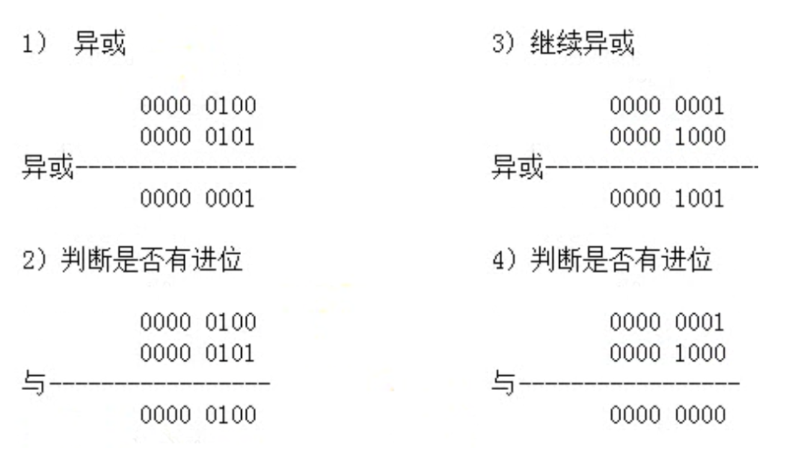


**作业1：使用异或对87AD6进行加密后再解密，加密密钥为5**

给出数字87AD6,加密密钥为5,采用异或(XOR)加密和解密的完整过程为:

```
1) 加密:
   8异或5 = D     1000 xor 0101 = 1101  转为16进制为D	
   7异或5 = 2     0111 xor 0101 = 0010  转为16进制为2
   A异或5 = 4     1010 xor 0101 = 1111  转为16进制为F
   D异或5 = 9     1110 xor 0101 = 1010  转为16进制为A
   6异或5 = B		0110 xor 0101 = 0011  转为16进制为3

所以加密后的结果是: D2FA3

2) 解密:
   D异或5 = 8
   2异或5 = 7
   F异或5 = A
   A异或5 = D
   3异或5 = 6

所以解密后的结果再得到原始的87AD6。

解析:

异或(XOR)算法会将两个数字的相应位进行比较:

- 当两个相应位相同时,结果为0
- 当两个相应位不同时,结果为1
```


# 6.汇编学习环境搭建


## 6.1 通用寄存器

在了解寄存器之前，我们需要知道计算机在哪存储数据，分别是三个地方：CPU > 内存 > 硬盘，寄存器是指CPU存储数据的地方。如果你是一个32位的CPU，那么它能提供的寄存器则有：8、16、32位的寄存器。

在本课程中学习的汇编语言是32位的，虽然现在大部分计算机都是64位的，但从本质上来说64位也是从32位衍生的，只有你学好了32位才能更容易的去学64位。

通用寄存器表示其通用性，可以往里面存储任意数据和值。

32位的通用寄存器（8个）：EAX、ECX、EDX、EBX、ESP、EBP、ESI、EDI

我们可以使用MOV指令取使用通用寄存器：**mov eax, 1**，其表示将eax的值变成1。

那么除了32位的通用寄存器外还有8位、16位，我们分别来看一下：


| 通用寄存器 |      |        |
| :--------: | :--: | :----: |
|    32位    | 16位 |  8位   |
|    EAX     |  AX  | AL、AH |
|    ECX     |  CX  | CL、CH |
|    EDX     |  DX  | DL、DH |
|    EBX     |  BX  | BL、BH |
|    ESP     |  SP  |        |
|    EBP     |  BP  |        |
|    ESI     |  SI  |        |
|    EDI     |  DI  |        |

从这张表中我们可以总结一下：

1. （知识）只有EAX、ECX、EDX、EBX有8位寄存器
2. （技巧）16位寄存器名称就是去掉了32位寄存器的E、8位就是32位中间的字母加上L和H

举例：那么AX、AL、AH分别代表着EAX的哪一部分呢？我们使用DTDebug打开一个EXE可执行文件：

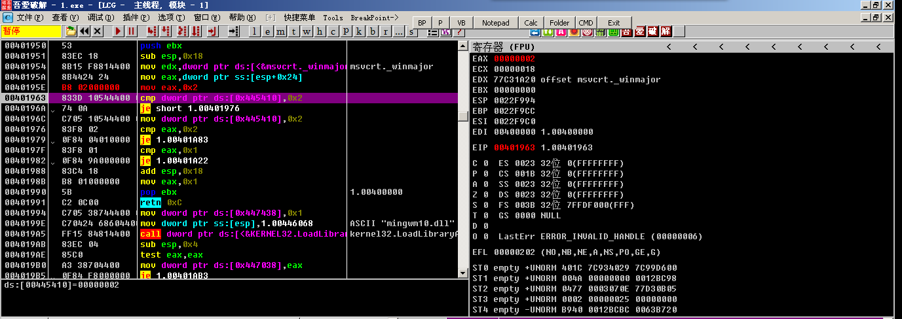


我们可以很清晰的在右边看见8个32位通用寄存器及其对应的值，这里表示出来是以十六进制形式，所以值一共有八个，一个表示4位，2个表示一个字节。

我们要想分清楚AX、AL、AH分别代表着EAX的哪一部分，可以使用MOV指令来看看。


**MOV AX, 0x1111**：AX占2个字节（4个16进制），AX表示EAX中的2个低位字节（**或者可以理解**：表示EAX从右到左的2个字节）。

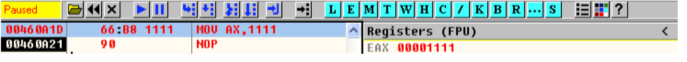

**MOV AL, 0x22**：AL占1个字节（2个16进制），AL表示AX中的一个低位字节。

**MOV AH, 0x33**：AH占1个字节（2个16进制），AH表示AX中的一个高位字节。

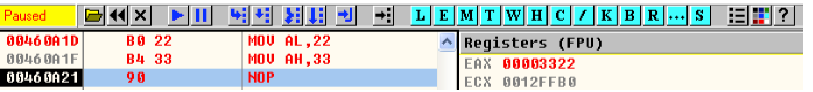

了解了EAX、AX、AL、AH，其他的寄存器以此类推即可。

**题外话**：看这个数值，从右到左，偏左的为高位；除特定值以外，汇编不区分大小写。


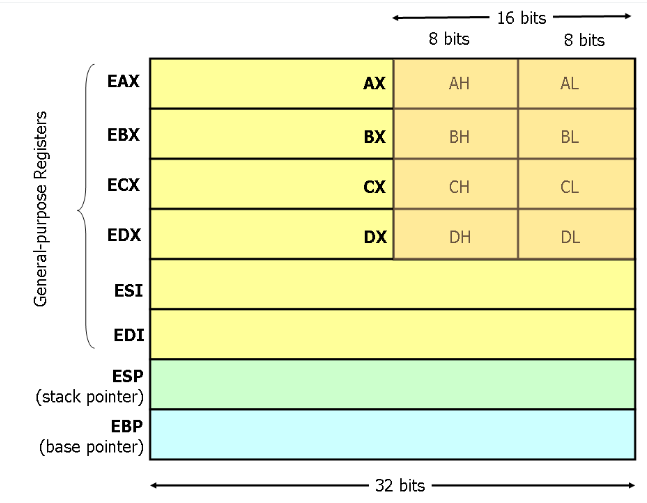


## 6.2 内存

每个应用程序都会有自己的独立4GB内存空间，这里的内存说的就是这4GB而并不是我们所熟悉的内存条。

内存和寄存器都是存储数据的，但由于CPU中的寄存器有限（造价比较昂贵），所以我们可以给每一个寄存器取名，但内存不一样，内存太大了无法取名字，所以我们只能使用编号。当我们想向内存中读取数据时，就需要使用到这个编号，这个编号我们称之为内存地址（32位），每一个内存地址（编号）都能存储一个字节（8位）。内存地址是32位的（**32位表示32个0和 1，但我们一般使用16进制去表示，例如：0x00000000**），程序独立存储的内存空间范围为：0 - 0xFFFFFFFF，能存储的位数就是**(0xFFFFFFFF+1)\*8**，加一是因为0也算一位，乘八是因为每块内存可以存储一个字节（8位），转为十进制就是：**34359738368 / 8 / 1024 / 1024 / 1024 = 4G**（换算：1Byte = 8Bit, 1KB = 1024Byte, 1MB = 1024KB, 1GB = 1024MB），这也就是**「每个应用程序都会有自己的独立4GB内存空间」**的原因。

之前我们学习过了MOV指令，那这个指令也可以向内存中添加数据或从内存中获取数据：

```
MOV DOWRD PTR DS:[内存地址], 立即数
MOV DOWRD PTR DS:[内存地址], 32位通用寄存器
MOV 32位通用寄存器, DOWRD PTR DS:[内存地址]
```

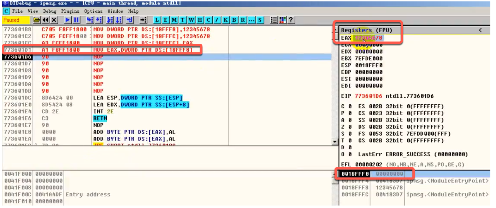


需要注意的是如上所述指令中DOWRD为数据宽度，存储的数据需要与DOWRD数据宽度一致，当然这里也可以为BYTE、WORD，例如：

```
MOV WORD PTR DS:[内存地址], 立即数
```


对应关系

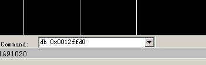

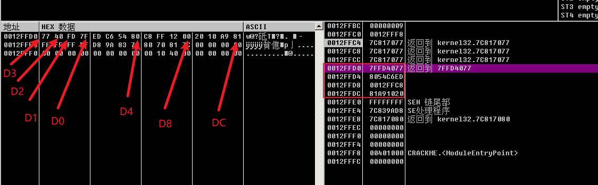


## 6.3 内存地址的5种形式

内存地址表示有很多种形式：

### 6.3.1 形式一：立即数

```assembly
// 读取内存的值
mov eax, dword ptr ds:[0x13FFC4]
```

 

```assembly
// 向内存中写入数据
mov dword ptr ds:[0X13FFC4], eax
```

### 6.3.2 形式二：[寄存器]

```assembly
// 读取内存的值
mov ecx, 0x13FFD0
mov eax, dword ptr ds:[ecx]
```

 

```assembly
// 向内存中写入数据
mov edx, 0x13FFD8
mov dword ptr ds:[edx], 0x87654321
```

### 6.3.3 形式三：[寄存器+立即数]

```assembly
// 读取内存的值
mov ecx, 0x13FFD0
mov eax, dword ptr ds:[ecx+4]
```

 

 

```assembly
// 向内存中写入数据
mov edx, 0x13FFD8
mov dword ptr ds:[edx+0xC], 0x87654321
```

### 6.3.4 形式四：[寄存器+寄存器*{1,2,4,8}]

```assembly
// 读取内存的值
mov eax, 0x13FFC4
mov ecx, 0x2
mov edx, dword ptr ds:[eax+eax*4]
```

 

 

```assembly
// 向内存中写入数据
mov eax, 0x13FFC4
mov ecx, 0x2
mov dword ptr ds:[eax+eax*4], 0x87654321
```

### 6.3.5 形式五：[寄存器+寄存器*{1,2,4,8}+立即数]

```assembly
// 读取内存的值
mov eax, 0x13FFC4 mov ecx, 0x2
mov edx, dword ptr ds:[eax+eax*4+4]
```

 

 

```assembly
// 向内存中写入数据
mov eax, 0x13FFC4
mov ecx, 0x2
mov dword ptr ds:[eax+eax*4+4], 0x87654321
```


### 6.3.6 获取内存编号

```assembly
# 获取内存编号，注意而不是获取内存编号的值
LEA EAX,DWORD PTR DS:[eax+eax*4+4]
```


# 7.常用汇编指令

我们常用的汇编指令有：MOV、ADD、SUB、AND、OR、XOR、NOT

如下格式举例中表示含义：

含义


r 代表通用寄存器

m 代表内存

imm 代表立即数

r8 代表8位通用寄存器

m8 代表8位内存

imm8 代表8位立即数

其他以此类推

## MOV指令

表示**数据传送**，其格式为：

```assembly
// MOV 目标操作数，源操作数
// 含义：将源操作数传送到目标操作数
MOV r/m8,r8
MOV r/m16,r16
MOV r/m32,r32
MOV r8,r/m
MOV r16,r/m16
MOV r32,r/m32
MOV r8, imm8
MOV r16, imm16
MOV r32, imm32
```

## ADD指令

表示**数据相加**，其格式为：

```assembly
// ADD 目标操作数，源操作数
// 含义：将源操作数与目标操作数相加，最后结果给到目标操作数
ADD r/m8, imm8
ADD r/m16,imm16
ADD r/m32,imm32
ADD r/m16, imm8
ADD r/m32, imm8
ADD r/m8, r8
ADD r/m16, r16
ADD r/m32, r32
ADD r8, r/m8
ADD r16, r/m16
ADD r32, r/m32
```

## SUB指令

表示**数据相减**，其格式为：

```assembly
// SUB 目标操作数，源操作数
// 含义：将源操作数与目标操作数相减，最后结果给到目标操作数
SUB r/m8, imm8
SUB r/m16,imm16
SUB r/m32,imm32
SUB r/m16, imm8
SUB r/m32, imm8
SUB r/m8, r8
SUB r/m16, r16
SUB r/m32, r32
SUB r8, r/m8
SUB r16, r/m16
SUB r32, r/m32
```

## AND指令

表示**数据相与（位运算知识）**，其格式为：

```assembly
// AND 目标操作数，源操作数
// 含义：将源操作数与目标操作数进行与运算，最后结果给到目标操作数
AND r/m8, imm8
AND r/m16,imm16
AND r/m32,imm32
AND r/m16, imm8
AND r/m32, imm8
AND r/m8, r8
AND r/m16, r16
AND r/m32, r32
AND r8, r/m8
AND r16, r/m16
AND r32, r/m32
```

## OR指令

表示**数据相或（位运算知识）**，其格式为：

```assembly
// AND 目标操作数，源操作数
// 含义：将源操作数与目标操作数进行或运算，最后结果给到目标操作数
OR r/m8, imm8
OR r/m16,imm16
OR r/m32,imm32
OR r/m16, imm8
OR r/m32, imm8
OR r/m8, r8
OR r/m16, r16
OR r/m32, r32
OR r8, r/m8
OR r16, r/m16
OR r32, r/m32
```

## XOR指令

表示**数据相异或（位运算知识）**，其格式为：

```assembly
// XOR 目标操作数，源操作数
// 含义：将源操作数与目标操作数进行异或运算，最后结果给到目标操作数
XOR r/m8, imm8
XOR r/m16,imm16
XOR r/m32,imm32
XOR r/m16, imm8
XOR r/m32, imm8
XOR r/m8, r8
XOR r/m16, r16
XOR r/m32, r32
XOR r8, r/m8
XOR r16, r/m16
XOR r32, r/m32
```

## NOT指令

表示**非（位运算知识）**，其格式为：

```assembly
// NOT 目标操作数
// 含义：将源操作数进行非运算，最后结果给到目标操作数
NOT r/m8
NOT r/m16
NOT r/m32
```

## MOVS指令

表示**数据传送**，它与MOV的不同处在于，它可以将内存的数据传送到内存，但也仅仅能如此，其格式为：

```assembly
// MOVS EDI指定的内存地址，ESI指定的内存地址
// 含义：将ESI指定的内存地址的数据传送到EDI指定的内存地址（使用MOVS指令时，默认使用的就是ESI和EDI寄存器），MOVS指令执行完成后ESI、EDI寄存器的值会自增或自减，自增或自减多少取决于传送数据的数据宽度
MOVS BYTE PTR ES:[EDI], BYTE PTR DS:[ESI] //简写为：MOVSB
MOVS WORD PTR ES:[EDI], WORD PTR DS:[ESI] //简写为：MOVSW
MOVS DWORD PTR ES:[EDI], DWORD PTR DS:[ESI] //简写为：MOVSD
```

**MOVS指令举例说明**：

1. 先将ESI、EDI的值修改为对应内存地址

```assembly
MOV ESI, 0x12FFC4
MOV EDI, 0x12FFD0
```

2. 将0x11223344存入EDI指定的内存地址中

```assembly
MOV DWORD PTR DS:[ESI], 0x11223344
```


# 8.堆栈

## 8.1 步骤一：压入数据			


​		

```assembly
MOV EBX,13FFDC			BASE
MOV EDX,13FFDC			TOP
```


方式一：			
			

```assembly
MOV DWORD PTR DS:[EDX-4],0xAAAAAAAA			
SUB EDX,4
```


方式二：			
			

```assembly
SUB EDX,4			
MOV DWORD PTR DS:[EDX],0xBBBBBBBB	
```


方式三：			
			

```assembly
MOV DWORD PTR DS:[EDX-4],0xDDDDDDDD			
LEA EDX,DWORD PTR DS:[EDX-4]	
```


方式四：			
			

```assembly
LEA EDX,DWORD PTR DS:[EDX-4]			
MOV DWORD PTR DS:[EDX],0xEEEEEEEE	
```

​		


## 8.2 步骤二：读取第N个数			

1、方式一：通过Base加偏移来读取			
			
读第一个压入的数据：			
			

```assembly
MOV ESI,DWORD PTR DS:[EBX-4]		
```


读第四个压入的数据：			
			

```assembly
MOV ESI,DWORD PTR DS:[EBX-0x10]	
```


​			
2、方式二：通过Top加偏移来读取			
​			
读第二个压入的数据：			
​			

```assembly
MOV EDI,DWORD PTR DS:[EDX+4]	
```


读第三个压入的数据：			
			

```assembly
MOV EDI,DWORD PTR DS:[EDX+8]			
```

## 8.3 步骤三：弹出数据			

​			

```assembly
MOV ECX,DWORD PTR DS:[EDX]			
LEA EDX,DWORD PTR DS:[EDX+4]			
			
MOV ESI,DWORD PTR DS:[EDX]			
ADD EDX,4			
			
LEA EDX,DWORD PTR DS:[EDX+4]			
MOV EDI,DWORD PTR DS:[EDX-4]			
```


# 9. 标志寄存器

EFLAGS寄存器


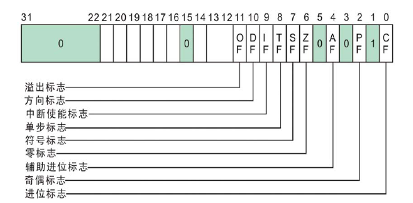


## 9.1 进位标志CF(Carry Flag):

查看DTDEBUG中的EFLAGS的值，然后转换成二进制的形式，并取出CF/PF/AF/ZF/SF/OF的值

例如：EFL 的值为`00000212`   转为二进制 为00100010010，即对应上图的值

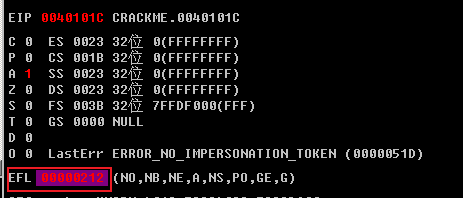


如果运算结果的**最高位**产生了一个进位或借位，那么，C的值为1，否则其值为0。

例如：**5555**FFFF，  5555 为最高位

```assembly
MOV AL,0xEF			
ADD AL,2				

MOV AL,0xFE	
ADD AL,2
```


## 9.2 奇偶标志PF(Parity Flag)：

奇偶标志PF用于反映运算结果中“1”的个数的奇偶性。

转为二进制后如果“1”的个数为偶数，则PF的值为1，否则其值为0。

```assembly
MOV AL,3
ADD AL,3
ADD AL,2
```


## 9.3 辅助进位标志AF(Auxiliary Carry Flag)：						

在发生下列情况时，辅助进位标志AF的值被置为1，否则其值为0：						
						
(1)、在字操作时，发生低字节向高字节进位或借位时；						
						
(2)、在字节操作时，发生低4位向高4位进位或借位时。						
						

```assembly
MOV EAX,0x55EEFFFF			
MOV AX,5EFE			
MOV AL,4E
ADD EAX,2			
ADD AX,2			
ADD AL,2
```

例如：

- 32位： FFFF**F**FFF      
- 16位：FF**F**F
- 8位：F**F**

以上粗体为判断标准，如果进位则AF的值为1


3 、 辅助进位标志 AF （ Au × 山 a C arn,t Flag)
在发生下列橘况时 ， 辅助进位标志 AF 的值被置力 1 ， 否则其值为 0 ：
（ 1 ） 、 在字作时 ， 发生低字节向高字节进位或惜位时 ；
（ 2 ）、 在字节操作时 ， 发生低 4 位向高 4 位进位或惜位时 。


## 9.4 零标志ZF(Zero Flag)：

零标志ZF用来反映运算结果是否为0。							
如果运算结果为0，则其值为1，否则其值为0。在判断运算结果是否为0时，可使用此标志位。							
							

```assembly
XOR EAX,EAX
							
MOV EAX,2
SUB EAX,2
```

​						


## 9.5 符号标志SF(Sign Flag)：

符号标志SF用来反映运算结果的符号位，它与运算结果的最高位相同。							


```assembly
MOV AL,7F							
ADD AL,2							
```


## 9.6 溢出标志OF(Overflow Flag)：

溢出标志OF用于反映有符号数加减运算所得结果是否溢出。							
如果运算结果超过当前运算位数所能表示的范围，则称为溢出，OF的值被置为1，否则，OF的值被清为0。							
							
							
最高位进位与溢出的区别：							
							
							
进位标志表示**无符号**数运算结果是否超出范围.							
							
溢出标志表示**有符号**数运算结果是否超出范围.							
							
溢出主要是给有符号运算使用的，在有符号的运算中，有如下的规律：							
							
正 + 正 = 正 如果结果是负数，则说明有溢出			
							
负 + 负 = 负 如果结果是正数，则说明有溢出							
							
正 + 负 永远都不会有溢出.	127 + （-1） =126						

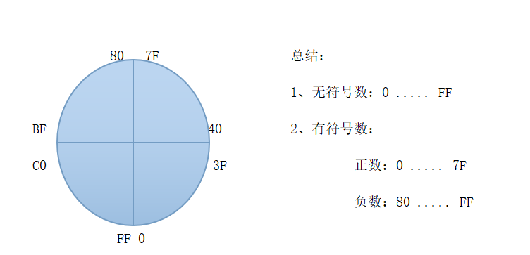

无符号表示范围是从0开始,到最大值为255(对于8位二进制来说)

有符号表示范围是从-128开始,到最大值为127(对于8位二进制来说)


1、无符号、有符号都不溢出			
			

```assembly
MOV AL,8		
ADD AL,8
```

2、无符号溢出、有符号不溢出			
			
```assembly
MOV AL,0FF		
ADD AL,2		
```

3、无符号不溢出、有符号溢出			
			
```assembly
MOV AL,7F		
ADD AL,2		
```

4、无符号、有符号都溢出			
			
```assembly
MOV AL,0FE		
ADD AL,80		
```


```assembly
ADC指令：带进位加法								
								
	格式：ADC  R/M,R/M/IMM   两边不能同时为内存  宽度要一样							
```


​									
​		ADC AL,CL							
​									
​		ADC BYTE PTR DS:[12FFC4],2							
​									
​		ADC BYTE PTR DS:[12FFC4],AL							
​									
	SBB指令：带借位减法								
									
		格式：SBB  R/M,R/M   两边不能同时为内存  宽度要一样							


​									
​		SBB AL,CL							
​									
​		SBB BYTE PTR DS:[12FFC4],2							
​									
​		SBB BYTE PTR DS:[12FFC4],AL							
​									
	XCHG指令：交换数据								
									
		格式：XCHG  R/M,R/M/IMM   两边不能同时为内存  宽度要一样							


​									
​		XCHG AL,CL							
​									
​		XCHG DWORD PTR DS:[12FFC4],EAX							
​									
​		XCHG BYTE PTR DS:[12FFC4],AL							
​									
	MOVS指令：移动数据  内存-内存								
									
		BYTE/WORD/DWORD							
									
		MOVS BYTE PTR ES:[EDI],BYTE PTR DS:[ESI]					简写为：MOVSB		
									
		MOVS WORD PTR ES:[EDI],BYTE PTR DS:[ESI]					简写为：MOVSW		
									
		MOVS DWORD PTR ES:[EDI],BYTE PTR DS:[ESI]					简写为：MOVSD		
									
		例子：							
									
		MOV EDI,12FFD8							
		MOV ESI,12FFD0							
		MOVS DWORD PTR ES:[EDI],DWORD PTR DS:[ESI]							
		MOVS DWORD PTR ES:[EDI],DWORD PTR DS:[ESI]							观察EDI的值
		MOVS DWORD PTR ES:[EDI],DWORD PTR DS:[ESI]							
		MOVS DWORD PTR ES:[EDI],DWORD PTR DS:[ESI]							
		MOVS DWORD PTR ES:[EDI],DWORD PTR DS:[ESI]							
									
		修改标志寄存器中D位的值，然后在执行下面的指令：							
									
		MOV EDI,12FFD8							
		MOV ESI,12FFD0							
		MOVS DWORD PTR ES:[EDI],DWORD PTR DS:[ESI]							
		MOVS DWORD PTR ES:[EDI],DWORD PTR DS:[ESI]							
		MOVS DWORD PTR ES:[EDI],DWORD PTR DS:[ESI]							观察EDI的值
		MOVS DWORD PTR ES:[EDI],DWORD PTR DS:[ESI]							
		MOVS DWORD PTR ES:[EDI],DWORD PTR DS:[ESI]							


​									
​									
​	STOS指令：将Al/AX/EAX的值存储到[EDI]指定的内存单元								


​									
​		STOS BYTE PTR ES:[EDI]			简写为STOSB				
​									
​		STOS WORD PTR ES:[EDI]			简写为STOSW				
​									
​		STOS DWORD PTR ES:[EDI]			简写为STOSD				


​									
​									
​		MOV EAX,12345678							
​		MOV EDI,12FFC4							
​		STOS BYTE PTR ES:[EDI]				观察EDI的值			
​		STOS WORD PTR ES:[EDI]							
​		STOS DWORD PTR ES:[EDI]							


​		修改标志寄存器中D位的值，然后在执行下面的指令：	


在x86架构的CPU中，标志寄存器中的D标志位是方向标志位（Direction Flag），用于控制字符串操作方向的标志位。

在进行字符串操作时，CPU会根据D标志位的值来决定操作是向前还是向后进行。具体来说，如果D标志位为0，则字符串操作是向前进行的；如果D标志位为1，则字符串操作是向后进行的。

例如，当使用REP MOVSB指令将一个字符串从内存中移动到另一个内存地址时，CPU会根据D标志位的值来决定移动方向。如果D标志位为0，则移动方向是从源地址向目标地址递增的；如果D标志位为1，则移动方向是从源地址向目标地址递减的。

需要注意的是，D标志位通常由系统软件来设置和清除，应用程序通常不需要直接操作它。在一些特殊场合下，可能会需要改变D标志位的值，例如在进行字符串反转操作或者对字符串进行特殊处理时。


​									
​		MOV EAX,12345678							
​		MOV EDI,12FFC4							
​		STOS BYTE PTR ES:[EDI]				观察EDI的值			
​		STOS WORD PTR ES:[EDI]							
​		STOS DWORD PTR ES:[EDI]							


​	REP指令：按计数寄存器 (ECX) 中指定的次数重复执行字符串指令								
​									
​		MOV ECX,10							
​									
​		REP MOVSD							
​									

		REP STOSD							


练习题：

1、熟练记住CF/PF/AF/ZF/SF/OF的位置

2、写汇编指令只影响CF位的值(不能影响其他标志位)

3、写汇编指令只影响PF位的值(不能影响其他标志位)

4、写汇编指令只影响AF位的值(不能影响其他标志位)

5、写汇编指令只影响SF位的值(不能影响其他标志位)

6、写汇编指令只影响OF位的值(不能影响其他标志位)

7、用MOVS指令分别移动5个字节、5个字、5个双字

8、用STOS指令分别存储5个字节、5个字、5个双字

9、使用REP指令重写第7、8题