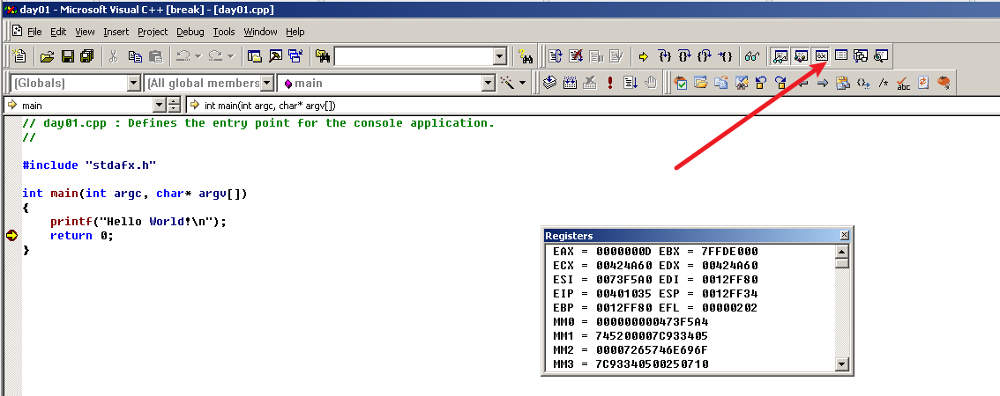

# 1. VC++ 6.0环境设置

## 1.1 新建项目


## 1.2 快捷键

F7 ：编译

ctrl+F5： 直接运行

ctrl+F5： 取消运行

F9： 下断点/取消断点


例如：F5运行程序一闪而过，可以使用 F9 下断点


**寄存器窗口：**



**内存窗口：**


例如想看程序变量y的值  F7 F5 运行后，把y拖到内存窗口第一行，0C 即y=10+2 =12 


# 2. C函数的格式

## 2.1 无参数，无返回值的函数格式

```c
void 函数(){
	代码;
}
```


## 2.2 有参数 无返回值

```c
void 函数(参数类型 参数名，参数类型 参数名){
	代码;
}
```


## 2.3 有参数 有返回值

```
 
```


# 3. 反汇编分析

## 3.1 空函数反汇编分析

C 语言：

```c
#include "stdafx.h"

void Function(){
}

int main(int argc, char* argv[])
{
	printf("Hello World!\n");


	Plus1(2,3);
	Function();
	return 0;
}
```


```assembly
# 开栈
00401010   push        ebp
00401011   mov         ebp,esp
00401013   sub         esp,40h

# 保护现场
00401016   push        ebx
00401017   push        esi
00401018   push        edi

# 缓冲区填充数据
00401019   lea         edi,[ebp-40h]
0040101C   mov         ecx,10h
00401021   mov         eax,0CCCCCCCCh
00401026   rep stos    dword ptr [edi]

# 恢复现场
00401028   pop         edi
00401029   pop         esi
0040102A   pop         ebx

# 降低堆栈
0040102B   mov         esp,ebp
0040102D   pop         ebp

# 函数返回
0040102E   ret
```


## 3.2 两个任意加法反汇编分析

```c
#include "stdafx.h"

void Function(){


}

//对任意两个数 加法
int Plus1(int x,int y){

	return x + y;

}

int main(int argc, char* argv[])
{
	printf("Hello World!\n");


	Plus1(2,3);
	Function();
	return 0;
}

```


```assembly
24:       Plus1(2,3);
# 参数
004010B5   push        3
004010B7   push        2

# 函数调用， 在 VC++ 6.0中 F10单步过 F11单步步入 函数
004010B9   call        @ILT+5(Plus1) (0040100a)

# 平衡堆栈
004010BE   add         esp,8
```


004010B9   call        @ILT+5(Plus1) (0040100a)

```assembly

# 开栈
00401060   push        ebp
00401061   mov         ebp,esp
00401063   sub         esp,40h

# 保护现场
00401066   push        ebx
00401067   push        esi
00401068   push        edi

# 缓冲区填充数据
00401069   lea         edi,[ebp-40h]
0040106C   mov         ecx,10h
00401071   mov         eax,0CCCCCCCCh
00401076   rep stos    dword ptr [edi]

13:
14:       return x + y;

# 
00401078   mov         eax,dword ptr [ebp+8]     # EAX 返回值
0040107B   add         eax,dword ptr [ebp+0Ch]   # EAX 返回值
15:
16:   }

# 恢复现场
0040107E   pop         edi
0040107F   pop         esi
00401080   pop         ebx

# 平衡堆栈
00401081   mov         esp,ebp
00401083   pop         ebp

# 返回
00401084   ret
```


## 3.3 三个任意整数加法反汇编分析

```c++
#include "stdafx.h"

void Function(){


}

//对任意两个数 加法
int Plus1(int x,int y){

	return x + y;

}

int Plus2(int x,int y,int z){
	int t;
	int r;
	t=Plus1(x,y);
	r=Plus1(t,z);

	return r;

}


int main(int argc, char* argv[])
{
	printf("Hello World!\n");


	Plus1(2,3);
	Function();
	return 0;
}

```


```assembly
33:       Plus2(2,3,4);
0040D7A5   push        4
0040D7A7   push        3
0040D7A9   push        2
0040D7AB   call        @ILT+15(Plus2) (00401014)
0040D7B0   add         esp,0Ch
```


0040D7AB   call        @ILT+15(Plus2) (00401014)

```assembly
00401014   jmp         Plus2 (00401090)


18:   int Plus2(int x,int y,int z){

# 开栈
00401090   push        ebp
00401091   mov         ebp,esp
00401093   sub         esp,48h

# 保护现场
00401096   push        ebx
00401097   push        esi
00401098   push        edi

# 缓冲区填充数据
00401099   lea         edi,[ebp-48h]
0040109C   mov         ecx,12h
004010A1   mov         eax,0CCCCCCCCh
004010A6   rep stos    dword ptr [edi]
19:       int t;
20:       int r;
21:       t=Plus1(x,y);

#  调用函数
004010A8   mov         eax,dword ptr [ebp+0Ch]
004010AB   push        eax
004010AC   mov         ecx,dword ptr [ebp+8]
004010AF   push        ecx
004010B0   call        @ILT+5(Plus1) (0040100a)
004010B5   add         esp,8
004010B8   mov         dword ptr [ebp-4],eax

22:       r=Plus1(t,z);
# 调用函数
004010BB   mov         edx,dword ptr [ebp+10h]
004010BE   push        edx
004010BF   mov         eax,dword ptr [ebp-4]
004010C2   push        eax
004010C3   call        @ILT+5(Plus1) (0040100a)
004010C8   add         esp,8
004010CB   mov         dword ptr [ebp-8],eax
23:
24:       return r;
004010CE   mov         eax,dword ptr [ebp-8]
25:
26:   }

# # 恢复现场
004010D1   pop         edi
004010D2   pop         esi
004010D3   pop         ebx

# 平衡堆栈
004010D4   add         esp,48h
004010D7   cmp         ebp,esp
004010D9   call        __chkesp (00401170)
004010DE   mov         esp,ebp
004010E0   pop         ebp
004010E1   ret
```


## 3.4 裸函数

裸函数不需要使用堆栈 不能被调用

```c
#include "stdafx.h"


// 裸函数
void __declspec(naked) Plus(){
     
}


int main(int argc, char* argv[])
{
	printf("Hello World!\n");
	Plus();
    
	return 0;
}
```


用汇编写出 两个数的和

```c
// day02.cpp : Defines the entry point for the console application.
//

#include "stdafx.h"


// 裸函数
int __declspec(naked) Plus(int x,int y){
    
    __asm{	
        // 开栈
		push ebp			
			mov ebp,esp			
			sub esp,0x40	
            //保护现场
			push ebx			
			push esi			
			push edi			
			lea edi,dword ptr ds:[ebp-0x40]			
			mov eax,0xCCCCCCCC			
			mov ecx,0x10			
			rep stosd			
			
			mov eax,dword ptr ds:[ebp+8]			
			add eax,dword ptr ds:[ebp+0xC]			
			
			pop edi			
			pop esi			
			pop ebx			
			mov esp,ebp			
			pop ebp			
			
			ret			
	}				    
}


int main(int argc, char* argv[])
{
	printf("Hello World!\n");
	Plus(1,2);
    
	return 0;
}
```


# 4. 数据类型

## 4.1 调用约定

| 调用约定   | 参数压栈顺序                          | 平衡堆栈     |
| ---------- | ------------------------------------- | ------------ |
| __cdecl    | 从右至左入栈                          | 调用者清理栈 |
| __stdcall  | 从右至左入栈                          | 自身清理堆栈 |
| __fastcall | ECX/EDX 传送前两个 剩下的从右至左入栈 | 自身清理堆栈 |

